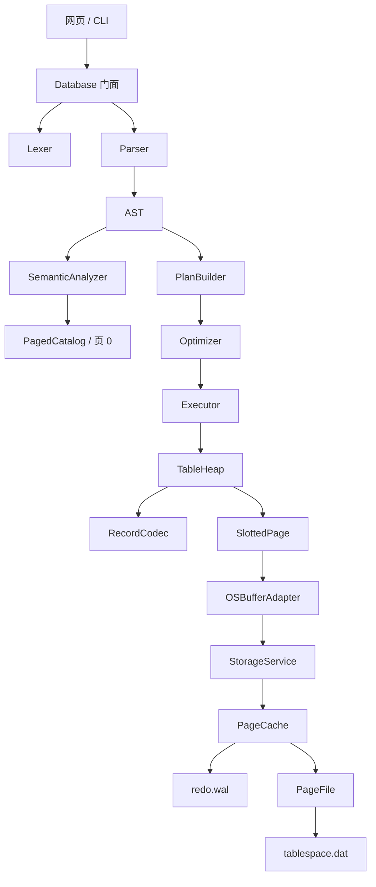

# 拾页 MiniDB：完整操作演示与源码讲解

> 适用场景：课程答辩、现场演示、代码抽查、实训报告补充。
>
> 对应版本：三人协作新版；以本仓库当前源码和 `docs/第三阶段验收矩阵.md` 为准。
>
> 阅读顺序：先按第 3 章完整操作一次，再沿第 5 章调用链阅读源码。

## 1. 一分钟讲清楚这个项目

拾页 MiniDB 是一个教学型单机数据库原型，它把三门课程连接成一条可运行链路：

```text
编译原理：SQL → Token → AST → 语义检查 → 逻辑计划 → 规则优化
数据库：  逻辑计划 → 执行算子 → Row / RID → TableHeap → Catalog
操作系统：数据库页 → Cache → WAL → Checkpoint → 4KB 页文件
```

三人按同一条链路分工，不是三个互不相关的小程序：

| 成员 | 主讲范围 | 交给下一层的核心接口 |
|---|---|---|
| A：SQL 编译器 | Token、Lexer、AST、Parser、Semantic、Plan、Optimizer | 把 SQL 交付为合法 PlanNode |
| B：操作系统页式存储 | PageStore、PageFile、LRU/FIFO、WAL、Checkpoint | 提供可靠的 4KB 页读写服务 |
| C：数据库引擎与集成 | Executor、TableHeap、RecordCodec、SlottedPage、Catalog、CLI/API | 用 Plan 驱动行操作，并通过 PageStore 落盘 |

答辩串联顺序是 A → C → B：A 解释“要做什么”，C 解释“怎样变成行和页操作”，B 解释“页怎样缓存并可靠写入磁盘”。

用户输入：

```sql
SELECT name FROM student WHERE 1 = 1 AND age > 10 + 8;
```

系统会经历：

```text
Lexer
  ↓
Parser：SelectStmt
  ↓
SemanticAnalyzer：student、name、age 是否存在，WHERE 是否为 BOOL
  ↓
PlanBuilder：Project → Filter → SeqScan
  ↓
Optimizer：10 + 8 → 18，1 = 1 AND X → X
  ↓
Executor：扫描表页 → 解码行 → 过滤 → 投影
  ↓
OSBufferAdapter → StorageService → PageCache → PageFile
```

### 必须先说明的边界

网页中有两套用途不同的数据链路：

| 页面 | 数据后端 | 用途 |
|---|---|---|
| 总览、图书、读者、借阅 | Python `sqlite3` + `library.db` | 展示一个完整桌面业务界面 |
| MiniDB 实验台 | 自研 `minidb/` + `os_sim/` | 课程真正考查的数据库内核 |
| OS 仿真台 | 独立 `os_sim/` | 展示页、缓存、脏页、替换事件、WAL 和 Checkpoint |

不要在答辩时说“整个图书系统完全由自研 SQL 引擎支撑”。准确说法是：图书室是上层业务演示；MiniDB 实验台才走自研编译、执行和页式存储全链路。

## 2. 项目目录总览

```text
database-lite/
├─ minidb/                       # 自研数据库内核
│  ├─ tokens.py                  # Token 类型和关键字表
│  ├─ lexer.py                   # 词法分析
│  ├─ ast.py                     # AST 节点
│  ├─ parser.py                  # 递归下降语法分析
│  ├─ semantic.py                # 名字绑定和类型检查
│  ├─ catalog.py                 # 模式对象和页 0 系统目录
│  ├─ plan.py                    # 逻辑执行计划
│  ├─ optimizer.py               # 规则优化
│  ├─ execution.py               # 算子、TableHeap、读写锁
│  ├─ engine.py                  # 数据库总入口
│  └─ storage/
│     ├─ page.py                 # 4KB Slotted Page
│     ├─ record.py               # Row 二进制编解码
│     ├─ os_adapter.py           # MiniDB 到 OS 页服务的适配器
│     ├─ disk.py                 # 第一阶段教学对照磁盘管理器
│     └─ buffer.py               # 第一阶段教学对照 LRU
├─ os_sim/                       # 独立操作系统存储仿真实体
│  ├─ interfaces.py              # PageStore 接口约束
│  ├─ page_file.py               # 页目录、Extent、CRC、物理文件
│  ├─ cache.py                   # LRU/FIFO、pin、dirty、刷回
│  ├─ wal.py                     # redo WAL
│  ├─ service.py                 # 统一存储服务与恢复
│  └─ errors.py                  # OS 层异常
├─ static/                       # 桌面网页
├─ tests/                        # 自动测试
├─ server.py                     # HTTP/API 入口
├─ minidb_cli.py                 # MiniDB 命令行入口
├─ os_sim_cli.py                 # OS 仿真命令行入口
├─ benchmarks/os_benchmark.py    # 缓存效果基准
├─ demo.sql                      # 可直接执行的完整 SQL 示例
├─ schema.sql / seed.sql         # 图书业务演示的 SQLite 模式和样例数据
├─ start.bat                     # Windows 一键启动
└─ docs/                         # 文法、报告、验收和本讲解
```

### 2.1 怎样把项目中的“压缩代码”逐句讲清楚

部分 Python 文件为了控制实训体量，把多个简单语句写在同一物理行。例如：

```python
self.path=path;path.parent.mkdir(parents=True,exist_ok=True);self.lock=RLock()
```

答辩时不能把它含糊地说成“初始化”。应按分号拆成三个逻辑步骤：

1. `self.path=path`：把构造参数保存成对象状态，后续读写都复用这个路径；
2. `path.parent.mkdir(...)`：递归创建父目录，`exist_ok=True` 让重复启动保持幂等；
3. `self.lock=RLock()`：为同一对象内的复合文件操作提供可重入互斥。

同理，`a=b=c` 是从右向左把同一个对象绑定给多个变量；`try/finally` 的 finally 无论成功或异常都执行；`with lock:` 表示离开代码块一定释放锁；`yield` 表示该函数返回惰性迭代器而非一次生成完整列表；`@dataclass` 自动生成构造和字段表示。本文后续按“状态字段 → 入口函数 → 分支顺序 → 不变量 → 设计理由 → 边界”的方式拆解代码。遇到一行多句时，按这里的方法逐个分号解释即可。

## 3. 完整操作演示

### 3.1 启动网页

在项目根目录打开 PowerShell：

```powershell
.\start.bat
```

脚本依次寻找 `py`、`python`、`python3`，最后尝试 Codex 自带 Python。看到下面文字表示启动成功：

```text
拾页图书室已启动：http://127.0.0.1:8000
按 Ctrl+C 停止服务
```

浏览器打开：

```text
http://127.0.0.1:8000
```

快捷入口：

```text
MiniDB 实验台：http://127.0.0.1:8000/?lab=1
OS 仿真台：    http://127.0.0.1:8000/?os=1
```

按 `Ctrl+C` 停止时，`server.py` 会关闭 HTTP 服务并调用 MiniDB、OS 仿真层的 `close()`，把脏页推进到一致检查点。

### 3.2 图书业务页面怎么演示

1. “总览”：展示馆藏数、可借数、读者数、借阅中数量和最近借阅。
2. “图书管理”：搜索书名、作者或 ISBN；点击右上角新增图书。
3. “读者管理”：新增读者，维护证号、院系和状态。
4. “借阅记录”：办理借阅时库存减一；归还后库存加一；过期且未还的记录显示“已逾期”。

这部分证明 API、事务式业务流程和桌面交互完整，但数据库课程内核要在后两页展示。

### 3.3 MiniDB 实验台操作

点击左侧“MiniDB 实验台”。右侧七个页签的含义：

| 页签 | 内容 |
|---|---|
| Token | 词法结果：类型、词素、值、行、列 |
| AST | 语法树及语义阶段回填的类型 |
| 语义 | 显示 `passed`，表示表名、列名和类型检查通过 |
| 原计划 | 未优化逻辑计划 |
| 优化后 | 常量折叠、布尔化简后的计划 |
| 执行结果 | 行集合或影响行数 |
| 页与目录 | `pg_catalog` 元数据和已分配物理页 |

“编译并检查”只执行到优化阶段，不改数据；“执行 SQL”才进入 Executor 和页存储。

#### 演示 A：排序条件查询

```sql
SELECT name, age FROM student
WHERE age >= 17
ORDER BY age DESC, name ASC;
```

预期计划：

```text
Project[columns=['name', 'age']]
  Sort[keys=[('age', 'DESC'), ('name', 'ASC')]]
    Filter[display=(age >= 17)]
      SeqScan[table=student]
```

执行顺序从树底向上：先扫描，后过滤，再排序，最后只返回 `name, age`。

#### 演示 B：优化前后对比

```sql
SELECT name FROM student
WHERE 1 = 1 AND age > 10 + 8;
```

原计划包含：

```text
((1 = 1) AND (age > (10 + 8)))
```

优化后变成：

```text
(age > 18)
```

这里能证明优化不是界面写死：测试也断言优化前含 `10`、优化后含 `18`，且恒真条件消失。

#### 演示 C：UPDATE 扩展

```sql
UPDATE student
SET age = age + 1
WHERE id = 2;
```

返回 `1 row(s) updated`。再次查询 `id=2` 能看到年龄增加。UPDATE 的右侧表达式基于原行计算；多列赋值不会因书写顺序互相污染。

#### 演示 D：查询系统目录

```sql
SELECT table_name, column_name, data_type, first_page
FROM pg_catalog
ORDER BY table_name, column_name;
```

`pg_catalog` 是只读特殊表。它展示逻辑表名、列名、类型、长度和该表物理首页号。执行：

```sql
DELETE FROM pg_catalog;
```

应得到 `SemanticError: system catalog 'pg_catalog' is read-only`，证明系统元数据不能被普通 DML 破坏。

#### 演示 E：四类基本 SQL

建议用命令行的独立数据目录演示，避免网页已有数据导致重复建表：

```powershell
py -3 minidb_cli.py --data defense_run_01
```

逐条输入：

```sql
CREATE TABLE demo(id INT, name VARCHAR(20), score INT);
INSERT INTO demo(id,name,score) VALUES(1,'甲',80);
INSERT INTO demo(id,name,score) VALUES(2,'乙',90);
SELECT id,name FROM demo WHERE score >= 85;
UPDATE demo SET score=score+5 WHERE id=1;
SELECT * FROM demo ORDER BY score DESC;
DELETE FROM demo WHERE id=2;
SELECT * FROM demo;
```

输入 `.quit` 退出。再次用同一个 `--data defense_run_01` 启动并查询，数据仍存在，证明不是内存假数据。

#### 演示 F：错误定位

```sql
SELECT @;
```

词法层报告非法字符和行列号。

```sql
SELECT name FROM student WHERE age > 18
```

语法层在 EOF 处报告缺少分号，并列出期望符号 `;`。

```sql
SELECT missing FROM student;
```

语义层报告列不存在。

```sql
INSERT INTO student(id,name,age) VALUES('bad',1,20);
```

语义层报告目标列期望 INT/VARCHAR 与实际值不一致。

### 3.4 MiniDB CLI 单命令模式

直接执行：

```powershell
py -3 minidb_cli.py --data demo_data --sql "SELECT * FROM pg_catalog;"
```

只看编译过程：

```powershell
py -3 minidb_cli.py --data demo_data --inspect --sql "SELECT name FROM demo WHERE score > 10 + 8;"
```

`--inspect` 输出 Token、AST、语义检查结果、优化前计划和优化后计划，不执行写入。也可以读取 UTF-8 SQL 文件：

```powershell
py -3 minidb_cli.py --data demo_data --inspect --file demo.sql
py -3 minidb_cli.py --data demo_data --file demo.sql
```

多语句只编译时会使用 Catalog 的内存快照：前面的 CREATE 能为后续 INSERT/SELECT 提供语义环境，但不会真的创建表。

### 3.5 OS 仿真台操作

打开“OS 仿真台”，按下列顺序操作：

1. “分配页”：页目录中一个空闲页变成深色，页号唯一。
2. “修改内存页”：写入完整 4KB after-image，WAL LSN 增加，frame 变 dirty。
3. 观察 Buffer Frames：包含 Page、Generation、Dirty、Pin、Page LSN。
4. “Checkpoint”：脏页清零，数据页写回，Checkpoint LSN 追上 WAL LSN。

页格说明：深色表示已分配，朱红外框表示驻留内存。页的物理偏移恒为：

```text
offset = page_id × 4096
```

### 3.6 OS CLI 操作

```powershell
py -3 os_sim_cli.py --data defense_os allocate
py -3 os_sim_cli.py --data defense_os write 0 "hello page"
py -3 os_sim_cli.py --data defense_os read 0
py -3 os_sim_cli.py --data defense_os status
py -3 os_sim_cli.py --data defense_os checkpoint
```

每次 CLI 命令结束都会正常 `close()`，所以它适合证明持久化；要观察“尚未刷回的 dirty 状态”，使用持续运行的网页 OS 仿真台。

### 3.7 自动测试与性能证明

```powershell
py -3 -m unittest discover -s tests -v
py -3 benchmarks/os_benchmark.py
```

测试覆盖 51 项行为，其中新增的编译器、存储、引擎三套验收测试共 24 项。基准重点看稳定指标而非某次毫秒数：

- 热读 1000 次新增磁盘读取为 0；
- 命中率约 99.9%；
- LRU 与 FIFO 对同一访问序列产生不同驻留集合；
- 全部 frame 被 pin 时明确拒绝淘汰，并保留 miss/evict 等事件证据。

## 4. 总体架构和模块边界



接口设计原则：

- Parser 不查文件，只构造语法结构。
- SemanticAnalyzer 不扫描数据，只借 Catalog 判断名字和类型。
- Executor 不解析 SQL，只执行 PlanNode。
- TableHeap 不关心 WAL，只面向 Row、RID 和 SlottedPage。
- OS 层不知道表名和列类型，只读写固定 4096 字节。
- PageFile 不决定替换算法，PageCache 不决定行编码。

这种分层比把所有逻辑写进一个文件更适合答辩：修改替换策略不会破坏 Parser；增加 SQL 语句不会修改 PageFile。

## 5. 一条 SELECT 的逐阶段调用链

以这条语句为例：

```sql
SELECT name FROM student WHERE age > 10 + 8 ORDER BY age DESC;
```

### 阶段 1：词法

`Lexer.tokenize()` 从左到右得到 `SELECT`、`name`、`FROM`、`student`、`WHERE`、`age`、`>`、`10`、`+`、`8`、`ORDER`、`BY`、`age`、`DESC`、`;`、EOF。

关键点：关键字统一为大写词素；普通标识符保留原文；整数的 `value` 是 Python int；每个 Token 带起始行列号。

### 阶段 2：语法

`Parser.statement()` 识别 SELECT，转到 `select()`；`WHERE` 后进入表达式优先级函数；`ORDER BY` 产生 `OrderItem(age,DESC)`。

AST 的核心结构：

```text
SelectStmt
├─ table: student
├─ columns: [name]
├─ where: BinaryExpr(Identifier(age), >, BinaryExpr(10,+,8))
└─ order_by: [OrderItem(age,DESC)]
```

### 阶段 3：语义

`SemanticAnalyzer.analyze()`：

1. `catalog.table('student')` 绑定表；
2. 检查输出列 `name`；
3. 检查排序列 `age`；
4. `expr(where)` 推导 `age` 为 INT、`10+8` 为 INT、比较结果为 BOOL；
5. WHERE 不是 BOOL 就停止，不让错误进入执行器。

### 阶段 4：计划

```text
Project[name]
  Sort[age DESC]
    Filter[age > 10 + 8]
      SeqScan[student]
```

为什么 Sort 在 Project 之前？因为 SQL 允许按未输出的列排序；若先投影，`age` 已经丢失。

### 阶段 5：优化

Optimizer 深拷贝计划，递归找到 Filter，将常量表达式 `10+8` 折叠成 `18`。深拷贝是为了同时展示“优化前”和“优化后”，而不是把原计划原地改没。

### 阶段 6：执行

`Executor.run()` 沿 children 找到最底层 SeqScan 的表名，取得 `student` 的表级读锁，然后 `_rows(Project)` 递归拉取：

1. SeqScan 调 `TableHeap.scan()`；
2. TableHeap 从 Catalog.first_page 出发遍历页链；
3. OSBufferAdapter 从 StorageService 取 4096 字节；
4. SlottedPage 遍历有效 slot；
5. RecordCodec 解码为字典；
6. Filter 调 `evaluate()`；
7. Sort 物化结果并排序；
8. Project 只保留 name；
9. 释放读锁，返回 columns/rows/affected。

## 6. 成员 A：编译器模块逐文件讲解

### 6.1 `minidb/__init__.py`

- 模块文档字符串说明包用途。
- `from .engine import Database` 把复杂内部模块隐藏起来。
- `__all__=['Database']` 规定外部推荐写法为 `from minidb import Database`。

这是门面导出，不含业务算法。

### 6.2 `minidb/tokens.py`

`TokenType` 是有限枚举：

- KEYWORD：SELECT、FROM 等保留字；
- IDENTIFIER：表名、列名；
- INTEGER/FLOAT/STRING：常量；
- OPERATOR：`+ - * / = != >=`；
- DELIMITER：括号、逗号、分号；
- EOF：输入结束哨兵。

`Token` 使用 `frozen=True`，词法生成后不可修改，避免后续阶段意外改 Token。字段：

```text
type      语法类别
lexeme    源程序中的词素（关键字规范化为大写）
location  起始行、列、offset
value     解码后的值，如整数 20、字符串 Tom's
```

`to_dict()` 为网页和 JSON 输出消除 Enum/对象不可序列化问题。`KEYWORDS` 是词法分类依据；UPDATE、ORDER BY 是选做扩展。

### 6.3 `minidb/errors.py`

`SourceLocation` 保存 line、column、offset。line/column 给人看，offset 便于未来截取源代码。

`MiniDBError` 统一格式：

```text
<Stage>Error at line x, column y: <message>; expected: A | B
```

子类只修改 `stage`：Lexical、Syntax、Semantic、Storage。好处是 API 只需捕获 `MiniDBError`，同时用户仍能看到错误发生阶段。

### 6.4 `minidb/lexer.py`

状态变量：

```text
source  完整 SQL
i       当前字符下标
line    当前行，从 1 开始
col     当前列，从 1 开始
```

三个基础函数：

- `here()`：把当前状态拍成 SourceLocation；
- `peek(n)`：只看不消费，越界返回 `\0`；
- `advance()`：消费字符，并且是唯一修改行列号的位置。

`tokenize()` 的分支顺序很重要：

1. 空白：消费但不产 Token；
2. `--`：跳过到行末；
3. `/*...*/`：寻找闭合符，EOF 前未闭合时报错；
4. 字母/下划线：连续读取标识符，再查 KEYWORDS；
5. 数字：先整数，可选小数点；小数点后必须有数字；数字后紧跟字母判非法；
6. 单引号：读取字符串，两个连续单引号表示内容中的一个单引号；
7. 分隔符；
8. 操作符，处理 `>= <= != ==`；单独 `!` 非法；
9. 其他字符直接 LexicalError；
10. 最后无条件追加 EOF。

为什么不使用正则一次切完？逐字符状态机更容易精确维护行列号、注释和字符串错误位置，适合编译原理展示。

### 6.5 `minidb/ast.py`

所有节点继承 `Node(location)`，所以任一语义错误都能回到源位置。`Node.to_dict()` 调 `asdict()` 递归转换，再补充实际节点类名。

表达式节点：

- IdentifierExpr：列引用；
- LiteralExpr：常量和常量类型；
- UnaryExpr：当前为 NOT；
- BinaryExpr：算术、比较、AND/OR；
- `inferred_type`：不参与构造，由语义阶段回填。

语句节点：CreateTableStmt、InsertStmt、SelectStmt、DeleteStmt、UpdateStmt。AST 只描述“用户写了什么”，不放磁盘页、锁或缓存对象。基础四类语句以外只保留 UPDATE 和 ORDER BY 两项扩展，不实现 EXPLAIN。

### 6.6 `minidb/parser.py`

Parser 初始化时先调用 Lexer，之后只处理 Token，不再接触字符。

通用函数：

- `current`：当前 Token；
- `match(...)`：如果当前词素匹配就前进，适合可选语法；
- `expect(x)`：必须匹配，否则 SyntaxError 并告诉用户期望 x；
- `identifier()`：必须是 IDENTIFIER，避免关键字被误当表名；
- `parse_all()`：直到 EOF，支持一个输入中多条语句。

语句函数：

- `statement()`：总分派，并统一要求普通语句以分号结束；
- `create()`：解析列名、INT/VARCHAR 和可选长度；
- `insert()`：解析目标列和 VALUES，当前 INSERT 值限定为 primary；
- `select()`：解析 `*`/列列表、FROM、可选 WHERE、可选 ORDER BY；
- `delete()`：解析表和可选 WHERE；
- `update()`：解析一个或多个 `列=表达式` 与可选 WHERE。

表达式优先级由函数调用层级保证：

```text
or_expr
└─ and_expr
   └─ not_expr
      └─ comparison
         └─ additive
            └─ multiplicative
               └─ primary
```

越靠下优先级越高。`a=1 OR b=2 AND c=3` 的根是 OR，右子树是 AND。循环构造使加减乘除左结合；NOT 递归调用自身。

### 6.7 `minidb/semantic.py`

语法正确不等于有意义。例如 `SELECT missing FROM student;` 能生成 AST，但必须在语义阶段失败。

`analyze(stmt)`：

- CREATE：在执行前检查重复表、重复列，并要求 `VARCHAR(n)` 的 n 为正整数；
- 其他语句：先绑定表；
- pg_catalog：只有 SELECT 合法；
- INSERT：列数=值数、目标列不重复、列存在、值类型匹配，并检查 VARCHAR 字面量长度；
- SELECT：输出列和排序列存在、WHERE 是 BOOL；
- DELETE：WHERE 是 BOOL；
- UPDATE：目标列不重复、目标列存在、赋值表达式类型匹配、VARCHAR 字面量长度合法、WHERE 是 BOOL。

`expr(e,table)` 递归推导：

- 常量直接取 literal_type；
- 标识符从 Catalog 取列类型；
- NOT 要求 BOOL；
- AND/OR 两侧都要 BOOL；
- 四则运算要求 INT/FLOAT；除法结果视为 FLOAT；
- 比较两侧类型应相同；Parser 不接受 SQL `NULL` 字面量，避免引入三值逻辑；
- 推导结果写入 `e.inferred_type`。

### 6.8 `minidb/plan.py`

`PlanNode` 包含 kind、args、children。`format()` 缩进输出树形计划，并隐藏不可读的原始表达式对象，只显示 display/set 等解释文本。

`expr_text()` 把表达式 AST 恢复成可读字符串，服务于计划展示，不用于执行。

PlanBuilder 映射：

| SQL | 计划 |
|---|---|
| CREATE | CreateTable |
| INSERT | Insert |
| DELETE WHERE | Delete → Filter → SeqScan |
| UPDATE WHERE | Update → Filter → SeqScan |
| SELECT | Project → Sort → Filter → SeqScan，按实际子句省略算子 |

Plan 是编译器和执行器之间的接口；Executor 不需要知道原 SQL 字符串。

### 6.9 `minidb/optimizer.py`

`eval_const(op,a,b)` 是常量运算表。`fold(e)` 后序遍历表达式：先优化左右子树，再处理当前节点。

规则：

- 两侧都是 LiteralExpr：编译期计算；
- 折叠结果为 `TRUE` 时，`TRUE AND X → X`、`X AND TRUE → X`；
- 折叠结果为 `FALSE` 时，`FALSE OR X → X`、`X OR FALSE → X`；
- `NOT 常量 → 常量`；
- 除零在优化期抛 SemanticError。

`Optimizer.optimize(plan)`：deepcopy 后递归访问 children；Filter 谓词折叠后更新 display；若最终为 TRUE，整个 Filter 被其 child 替代。

这是规则优化器，不是代价优化器：没有统计直方图、Join reorder、索引选择或代价估算。

### 6.10 `minidb/engine.py`

`Database` 是总门面。

初始化顺序：

1. 创建数据目录；
2. 创建 `StorageService(root/storage)`；
3. 创建从页 0 开始的 `PagedCatalog`；
4. 创建 OSBufferAdapter；
5. 创建 SemanticAnalyzer、PlanBuilder、Optimizer、Executor。

`compile(sql)`：Lexer → Parser → Semantic → PlanBuilder → Optimizer，返回可观察的中间结果，不执行。它复制当前 Catalog 为内存工作快照；遇到 CREATE 时只更新快照，因此同一脚本后续语句能通过语义检查，又不会改真实数据库。每条语句只返回属于自己的 Token 片段。

`execute(sql)`：按多语句顺序逐条分析和执行。为什么不能先分析完所有语句？因为 `CREATE TABLE; INSERT...;` 中第二条的语义环境依赖第一条已执行后的 Catalog。

每批执行结束调用 `buffer.flush_all()`，OSBufferAdapter 将其映射到 checkpoint。因此 Web/CLI 完成一次 execute 后数据页与 WAL 建立一致点。

## 7. 成员 C：Catalog 和执行器

### 7.1 `minidb/catalog.py`

`ColumnSchema`：列名、数据类型、VARCHAR 长度元数据。`TableSchema`：表名、列列表、first_page。

文件中保留了两种 Catalog 实现：

- `Catalog`：早期 JSON 教学实现，当前主路径不用；
- `PagedCatalog`：当前主路径，元数据通过 StorageService 保存在从页 0 开始的槽页链。

PagedCatalog 物理结构：

```text
页 0：SYP1 SlottedPage，保存若干目录行，next_page 指向后续目录页
目录行：table_name、column_name、data_type、length、column_order、first_page
后续页：同样是 SYP1 SlottedPage，直到 next_page = NO_PAGE
```

`_ensure_page()`：空库首次分配必须拿到 page 0；已有库若 page 0 丢失则拒绝启动，避免悄悄创建错误目录。

`load()`：页 0 不是槽页时初始化空目录；是槽页时沿 `next_page` 读取所有目录记录，按 table_name 分组、column_order 排序，再重建 dataclass。旧版 `CAT1 + JSON` 仅作为一次迁移入口，读取后立即保存为新版槽页结构。

`save()`：把每个列定义用 RecordCodec 编成一条目录记录并插入 SlottedPage；当前页放不下就分配下一页并更新页链，多余旧目录页会释放。每页都走 `store.write_page()`，因此 Catalog 同样受到缓存、WAL 和恢复保护。

`SYSTEM_SCHEMA` 定义可查询特殊表 `pg_catalog`；`rows()` 将内部每列元数据展开成行。现在它在逻辑和物理两方面都真正使用普通记录编码与 SlottedPage，而不是把 JSON 包装成“特殊表”。

### 7.2 `minidb/execution.py`：表达式

`OPS` 将 AST 操作符映射到 Python 函数。`evaluate(expr,row)`：

- Literal 返回值；
- Identifier 按大小写不敏感从行字典取值；
- Unary 当前做逻辑非；
- Binary 先递归求左右值，再调用 OPS。

执行器不再检查类型，因为语义层已经保证计划合法。

### 7.3 `RWLock`

状态：Condition、readers 计数、writer 布尔值。

- 读锁：有 writer 时等待，否则 readers+1；
- 释放读锁：readers-1 并唤醒等待者；
- 写锁：writer=true 或 readers>0 时等待；
- 释放写锁：writer=false 并唤醒。

效果是同表多 SELECT 可并行，INSERT/UPDATE/DELETE 独占。它是进程内表级锁，不是行锁、MVCC 或跨进程文件锁；当前实现也没有写优先，极端持续读可能让写等待。

### 7.4 `TableHeap`

TableHeap 把执行器的“行操作”翻译成页操作。

`_pages(schema)`：从 `first_page` 开始 yield page_id；读取页头 next_page，直到 None/NO_PAGE。

`scan(schema)`：逐页进入 OSBufferAdapter 上下文，遍历有效 slots，RecordCodec.decode 后产生 `(RID,row)`。

`insert(schema,row)`：

1. 编码 payload；
2. 遍历现有页，调用 SlottedPage.insert；
3. 找到空间则返回 `(page_id,slot)`；
4. 全满则分配新页；
5. 空表更新 Catalog.first_page；非空表更新旧尾页 next_page；
6. 单行大于一页时报 StorageError。

`delete(rid)`：进入对应页，把 slot.length 置 0。

`update(schema,rid,row)`：先尝试原页更新；若放不下，先插入新位置，成功后 tombstone 旧 RID。没有 Undo，因此迁移更新不是完整事务原子操作。

### 7.5 `Executor`

`lock(table)` 按小写表名缓存 RWLock。

`run(plan)` 分支：

- CreateTable：Plan 参数转为 TableSchema，注册 Catalog；
- Insert：创建包含所有列的行，未指定列默认 None；求值后加写锁并插入；
- Delete：加写锁，先 `list(_rows(...))` 固定待删 RID，再逐个 tombstone，避免边扫描边修改迭代器；
- Update：加写锁，复制 original/updated，所有赋值从 original 求值，再更新；
- 查询：找到最底层表，加读锁，把 iterator materialize 为结果列表。

`_rows()` 实现 iterator model：

- SeqScan：普通表走 TableHeap；pg_catalog 走 Catalog.rows；
- Filter：evaluate(predicate,row) 为真才 yield；
- Project：构造只含指定列的新字典；
- Sort：先物化；从最后一个排序键向前做稳定排序，从而得到正确多键顺序；内部缺省值固定放末尾，但 SQL 输入不支持 NULL 字面量。

## 8. 成员 C：行格式与页格式

### 8.1 `minidb/storage/record.py`

记录格式：

```text
[column_count:u16][NULL bitmap][field bodies...]
```

例如三列时 NULL bitmap 只需一个字节；第 i 位为 1 表示该字段为空，因此 body 中不写它。

字段编码：

- INT：`struct.pack('<q')`，8 字节小端有符号整数；越过 64 位范围时转成明确的 StorageError；
- VARCHAR：`uint32 byte_length + UTF-8 bytes`，编码前再次检查 `VARCHAR(n)` 字符长度，防止绕过语义层写入超长值。

中文必须先 UTF-8 编码再记录字节长度。例如一个汉字通常多于一个字节，不能用 Python 字符数当磁盘长度。

decode 使用同样顺序推进 pos，必须与 encode 完全互逆。Schema 决定每个字段该读 8 字节还是长度前缀字符串。

### 8.2 `minidb/storage/page.py`

常量：PAGE_SIZE=4096、数据页 MAGIC=`SYP1`、NO_PAGE=`0xFFFFFFFF`。

页头 `struct '<4sIHHHI'` 共 18 字节：

```text
magic       4B
page_id     4B
slot_count  2B
free_start  2B
free_end    2B
next_page   4B
```

每个 Slot 为 `<HH>`，保存 record offset 和 length，共 4 字节。

```text
低地址
┌───────────────┬───────────────┬──────────┬──────────────┐
│ Header 18B    │ Slot0 Slot1…  │ free     │ records      │
└───────────────┴───────────────┴──────────┴──────────────┘
                    → free_start  free_end ←
高地址
```

`__init__`：读取已有页时校验 magic/page_id；创建新页时写初始头。`dirty` 只存在内存。

`insert(payload)`：检查 `payload + 新槽` 是否小于空闲区；记录从页尾向前写，槽从页头向后写；返回旧 slot_count 作为新 slot_id。

`read(slot)`：先检查槽边界，再按 offset/length 切 bytes；length=0 表示 tombstone。

`delete(slot)`：不移动记录，只把 length 清零，RID 不变但产生碎片。

`update(slot,payload)`：

- 新值不长于旧值：复用旧位置；
- 新值更长但本页连续空闲区够：从 free_end 再放一份并改槽指针；
- 本页放不下：返回 False，让 TableHeap 迁移。

`records()` 遍历所有槽并跳过 tombstone。

### 8.3 `minidb/storage/os_adapter.py`

OS 层只认识 bytes，数据库层要操作 SlottedPage；Adapter 负责转换。

- `page(page_id)`：read_page 得到 bytes，包装为 SlottedPage；退出 with 时若 dirty，就 write_page 完整 4096 字节；
- `new_page()`：底层分配页号，在内存创建新 SlottedPage，暂存 pending；
- `unpin()`：把 pending 新页真正交给 StorageService；
- `flush_all()`：映射为 checkpoint；
- `stats()`：透传缓存和 I/O 指标。

这层存在后，TableHeap 不需要知道 redo.wal、LRU 或文件名。

### 8.4 `disk.py` 与 `buffer.py` 为什么还在

它们是第一阶段教学对照：DiskManager 直接读写 data.syp，BufferPool 实现简单 LRU。当前 `Database` 不使用它们，主路径是 OSBufferAdapter → 根目录 `os_sim/`。

保留原因：能单独展示最小 page_id×4096 和 LRU 原理；测试 `test_page_id_maps_to_file_offset` 也用它验证最基本映射。答辩时必须区分“早期对照实现”和“最终集成主路径”。

### 8.5 `minidb/storage/__init__.py`

该文件只把早期教学接口 DiskManager、BufferPool 和通用 RecordCodec 导出，并用 `__all__` 限定推荐的公共名字。当前主路径直接导入 OSBufferAdapter，因此“包里能导出 BufferPool”不等于“最终引擎仍用旧 BufferPool”。它的意义是保留第一阶段实验兼容性。

## 9. 成员 B：操作系统仿真模块逐文件讲解

### 9.1 `os_sim/interfaces.py`

`PageStore(Protocol)` 规定数据库可依赖的最小接口：allocate、release、read、write、checkpoint、stats。Protocol 是结构化接口：实现类不必显式继承，只要方法形状一致即可。

为什么接口按整页而不是按行？若 OS 接口知道 Row/Schema，就污染数据库边界；若上层直接 seek 文件，就能绕开 Cache/WAL。

### 9.2 `os_sim/errors.py`

- CorruptPage：页长度或 CRC 不正确；
- InvalidPage：越界页或未分配页；
- WriteBarrierError：日志未持久却尝试刷数据页。

### 9.3 `os_sim/page_file.py`

物理文件：

```text
tablespace.dat   完整 4KB 页数组
control.0.json   控制文件副本 1
control.1.json   控制文件副本 2
```

控制信息：version、generation、page_count、allocated bitmap、每页 generation、每页 CRC32、checkpoint_lsn。

`_load_control()`：分别尝试读取两份；损坏副本被忽略；选择 generation 最大的有效值。控制声称的页数量不能超过数据文件实际大小。

`_save_control()`：先写 `.tmp`，flush+fsync，再 `os.replace`；两个副本都写。这样避免直接覆盖时留下半个 JSON。

`_grow_extent()`：一次追加 64×4096 个零字节，同时扩展位图和数组。逐页扩文件简单但频繁，Extent 减少增长次数。

`allocate_page()`：找第一个 False；没有则 grow；标记已分配、generation=1、空白页 CRC，保存控制文件。

`release_page()`：验证后清位图、generation、CRC，把物理页清零并 fsync。下次优先复用空洞页号。

`read_page()`：validate → `seek(page_id×4096)` → 读满 4096 → CRC 校验 → 返回 `(payload,generation)`。

`write_page()`：要求正好 4096 字节；写入对应偏移并 fsync；更新 generation/CRC；保存控制文件。

`_migrate_v1_pages()` 是旧格式兼容：v1 在 4KB frame 内占 20 字节物理头，只给上层 4076 字节；v2 把 generation/CRC 移到控制文件，让数据库完整使用 4096 字节。迁移用临时文件原子替换。

### 9.4 `os_sim/wal.py`

WAL 是 append-only JSON Lines。每条记录包含：

```text
lsn、kind=PAGE、page_id、generation、payload(base64)、crc32
```

`append_page()`：构造完整页 after-image → 追加一行 → flush → `os.fsync` → 更新 durable_lsn。只有 fsync 成功才返回，所以 PageCache 之后才能把 frame 标脏。

`records()`：逐行 JSON/base64/CRC 校验；遇到崩溃留下的不完整尾记录就停止，保留之前完整记录。

选择完整 after-image 的原因是恢复简单、可解释、幂等；代价是每次页写约增加 4KB WAL，不是生产数据库的紧凑 physiological log。

### 9.5 `os_sim/cache.py`

Frame 字段：page_id、payload、generation、dirty、pin_count、page_lsn、loaded_at。

OrderedDict 的头部是最先淘汰候选，尾部是最新位置。

`fetch()`：

- 命中：hits+1；LRU 移到尾部，FIFO 不移动；
- 未命中：misses+1；满时 `_evict()`；从 PageFile 读；放到尾部；
- pin=True 时 pin_count+1。

LRU/FIFO 的关键差别只有“命中时是否 move_to_end”，因此对照实验可信，不是两套不等价代码。

`update()`：fetch 并 pin → generation+1 → WAL.append_page → 更新 frame payload/dirty/page_lsn → unpin。

`_flush()`：先检查 `page_lsn <= wal.durable_lsn`，通过后 PageFile.write_page，清 dirty，记录 flush 事件。

`_evict()`：从头寻找第一个 pin_count=0 的 frame；dirty 先刷，clean 直接移除；全部 pinned 时明确失败。

`events` 最多保留 event_limit 条，防止长期运行日志无界占内存。stats 计算 hit_rate 和各种 I/O 计数。

### 9.6 `os_sim/service.py`

StorageService 把 PageFile、WAL、PageCache 组合成独立实体。

初始化先创建文件和日志，再建缓存，随后 `_recover()`：

1. 忽略 checkpoint_lsn 之前日志；
2. 解码 after-image；
3. 忽略旧版非 4096B 日志；
4. 读取磁盘页 generation；
5. 只有磁盘更旧才重放；
6. 有恢复时推进 checkpoint。

generation 判断让 redo 幂等：重复启动不会把同一版本无限重写。

`write_page()`：检查页长 → PageCache.update → 计算 dirty/capacity；达到阈值就 `flush_due()`。

脏页刷回三个时机：

1. 淘汰 dirty victim；
2. dirty ratio 达阈值；
3. checkpoint/正常 close。

`checkpoint()` 必须先 flush_all，再写 control.checkpoint_lsn，顺序不能反。

### 9.7 `os_sim_cli.py` 和 benchmark

CLI 的 `fixed_payload()` 把 UTF-8 文本零填充到 4096 字节。argparse 子命令映射 StorageService 方法；finally 始终 close。

benchmark 用 `perf_counter()` 测一次冷读和 1000 次热读，并比较磁盘读取次数与命中率。`tempfile` 保证不污染正式数据库。

### 9.8 `os_sim/__init__.py`

包入口只公开 StorageService。上层无需导入 PageFile、PageCache、WAL 再自行拼装，防止绕过统一恢复与刷页顺序；需要做白盒测试时才直接进入具体子模块。

## 10. 成员 C：Web/API 和图书业务代码

### 10.1 `server.py` 全局对象

```text
DB_PATH  = library.db            SQLite 图书业务
MINIDB   = minidb_demo/storage   自研数据库
OS_STORE = os_sim_demo           独立 OS 演示
STATIC   = static/               前端文件
```

首次启动若 MiniDB 没有 student 表，就通过自研 SQL 创建并插入 Alice/Bob。

### 10.2 SQLite 辅助函数

- ClosingConnection：with 退出时 commit/rollback 后显式 close；
- connect：每个请求新连接，Row 可转字典，开启外键；
- init_db：可选删除 library.db，再执行 schema.sql/seed.sql；
- rows：cursor.fetchall 转 JSON 友好字典；
- required：检查 HTTP 表单必填字段。

### 10.3 HTTP Handler

`send_json()`：ensure_ascii=False 保留中文，设置 UTF-8 和 Content-Length。

`read_json()`：按 Content-Length 读取；非法 JSON 转为 ApiError(400)。

`route()`：拆分 path/query。

`do_GET()`：API 交给 get_api；静态文件先 resolve 并检查仍位于 STATIC 下，阻止 `../` 路径穿越。

图书 GET API：

- `/api/dashboard`：子查询汇总 + 最近借阅；
- `/api/books`、`readers`、`loans`：参数化 LIKE，避免把 q 拼进 SQL；
- `/api/minidb/status`：Catalog、页目录、缓存/WAL 指标；
- `/api/os/status`：页、frames、最近事件。

POST API：

- 新增图书/读者；
- 办理借阅：校验库存和读者状态，在同一 SQLite with 事务内减库存并建借阅记录；
- MiniDB inspect/execute：调用自研 Database，返回中间结构和物理状态；
- OS action：分配页、写页和 checkpoint。

PUT `/api/loans/{id}/return`：防止重复归还；同一事务内更新借阅状态和库存。

异常映射：业务 ApiError 保留状态码；SQLite 约束冲突为 409；其他异常为 500。MiniDBError 转 400 并保留阶段、位置和原因。

### 10.4 `schema.sql` / `seed.sql`

schema 建 books、readers、loans，使用 UNIQUE、CHECK、FOREIGN KEY 保护业务不变量，并为常用搜索建索引。

seed 使用 `INSERT OR IGNORE`，重复启动不会反复插入样例。书籍、人员、编号均为演示数据。

### 10.5 `static/index.html`

定义固定侧栏、主标题、内容区、业务对话框、toast；所有图标是统一 stroke SVG，不使用 emoji。脚本顺序为 app.js → minidb.js → os.js，后两个接管各自导航项。

### 10.6 `static/app.js`

- `$`/`$$` 简化选择器；
- `api()` 统一 fetch/JSON/错误；
- `esc()` 转义服务端文本后再进入 innerHTML，防止样例数据注入；
- `table()`、toolbar、status 是复用渲染函数；
- dashboard/books/readers/loans 各自拉 API 并渲染；
- openForm 根据业务生成字段；
- submit 和 returnBook 调接口、toast、刷新当前页。

### 10.7 `static/minidb.js`

samples 提供排序、更新、系统目录三个可切换示例。点击导航后构造左右工作台；执行按钮禁用表示 loading，finally 恢复。

`runLab(mode)` 调 inspect/execute，保存 labResult，并更新页数、命中率、磁盘读写、checkpoint。`renderStage()` 使用 `textContent` 输出 JSON，避免 SQL/结果成为 HTML。

### 10.8 `static/os.js`

`renderOS()` 将 API 状态转换成指标、页格、Frame 表和事件日志；`cached Set` 用于给驻留页加视觉状态。

`osAction()`：write 时选择一个已分配页，没有就先分配；每次操作完成后重新拉取真实状态，避免界面用本地假数据。

### 10.9 CSS 文件

- style.css：全局颜色、字体、侧栏、表格、对话框、按钮和焦点；
- icons.css：SVG stroke 规则；
- minidb.css：双栏 SQL 工作台、编辑器、页签、输出区、loading/error；
- os.css：指标带、页目录格、frame 表、事件日志。

样式文件被压成少量长行，只是格式紧凑，不代表一条规则；阅读时按 `{...}` 拆分选择器。项目明确只做桌面端，CSS 设置 `min-width:1080px`，没有声称支持移动端。

### 10.10 `minidb_cli.py` 与 `start.bat`

`minidb_cli.py` 用 argparse 接收 `--data`、互斥的 `--sql`/`--file`，以及 `--inspect`。`--sql` 直接处理文本，`--file` 读取 UTF-8 SQL 文件；二者都没有时进入 REPL，把输入累积到分号后执行，`.quit` 退出。只捕获 MiniDBError，因此编译错误按课程阶段显示，而真正的程序错误不会被伪装成 SQL 错误。

`start.bat` 先切换到脚本目录，避免从别处双击时找不到静态文件；随后按 `py -3`、`python`、`python3`、Codex bundled Python 的顺序寻找解释器。每个成功分支都运行 `server.py` 并跳到 done；最后的 pause 让双击窗口保留错误或退出信息。

### 10.11 根目录说明与配置文件

- `.gitignore`：排除 SQLite 运行库、自研表空间、WAL、临时文件和 Python 缓存；
- `README.md`：仓库首页，只保留快速启动、架构摘要和文档入口；
- `PRODUCT.md`：产品目标、用户和功能边界；
- `DESIGN.md`：桌面界面的视觉和交互规范；
- `docs/*.md`：三个阶段的验收矩阵、设计取舍、测试报告、三人分工报告和答辩材料，不参与运行；
- `docs/assets/*.png`：已经验证过的桌面页面截图，也不参与程序逻辑。

这些文件与 Python/JS 源码的关系是“解释和约束实现”，不是运行时依赖。删除说明文档不会改变执行结果，但会失去需求到代码的可追踪性。

## 11. 测试文件逐项解释

### 11.1 `tests/test_minidb.py`

CompilerTests：

- 验证注释后的行列号、大小写不敏感、SQL 单引号转义；
- 验证 AND 优先于 OR；
- 验证 UPDATE/ORDER BY AST；
- 验证同一脚本中 CREATE 后的 INSERT/SELECT 可以只编译检查，且不修改真实 Catalog；
- 验证非法字符和语法错误分类。

StorageTests：

- 中文 bytes 插入、读取、tombstone；
- 两页对应 8192 字节，证明 offset 公式。

EndToEndTests：

- 每个测试使用 TemporaryDirectory，互不污染；
- CRUD + 优化前后；
- 表列/类型、重复建表和 VARCHAR 长度语义错误；
- UPDATE、ORDER BY、pg_catalog；
- 300 行跨页、条件查询、删除、重启持久化；
- 创建 80 张表使系统目录跨页，并验证重启后仍能恢复全部模式。

### 11.2 `tests/test_os_sim.py`

- v1 4076B payload 到 v2 完整 4KB 迁移；
- 65 页触发第二个 Extent，释放页 7 后复用；
- 正确读写和释放后 InvalidPage；
- 100 次热读只有首次磁盘 miss；
- 同一访问序列下 LRU 驻留 `{0,2}`、FIFO 驻留 `{1,2}`；
- 缓存只有一个 frame 且已 pin 时拒绝淘汰，释放后产生 miss/evict/miss 事件；
- WAL 未 durable 时禁止刷页；
- 未 checkpoint 崩溃后重启重放；
- checkpoint 后 dirty=0 且 LSN 一致。

### 11.3 `tests/test_compiler_acceptance.py`

这是成员 A 的课程标准验收集，共 9 项：逐类检查 Token、位置、注释、大小写和字符串转义；检查 4 类基础 AST 与 2 个受控扩展；检查错误位置、期望符号、表列绑定、类型规则和 `Project → Filter → SeqScan` 计划结构。

### 11.4 `tests/test_storage_acceptance.py`

这是成员 B 的课程标准验收集，共 8 项：检查 INT64/中文/NULL 的行编解码、损坏记录和损坏槽页拒绝、缓存配置边界、CRC 页损坏检测、dirty 阈值刷回、checkpoint LSN 一致性，以及一个控制文件损坏后从另一副本恢复。

### 11.5 `tests/test_engine_acceptance.py`

这是成员 C 的课程标准验收集，共 7 项：检查完整 CRUD 和 INSERT 显式列序、变长 UPDATE、按未投影列排序、数据与元数据重启恢复、系统目录只读、失败批处理的停止位置、超大记录失败时不泄漏已分配页，以及 UTF-8 SQL 文件经 CLI 执行。

### 11.6 `tests/test_api.py`

在随机空闲端口启动真实 ThreadingHTTPServer，SQLite 指向临时文件。验证 dashboard、新增图书、借还库存，以及 MiniDB API 能输出语义结果、Sort、Catalog 和已分配页。

### 11.7 `tests/test_fuzz.py`

固定随机种子生成 300 条随机 SQL。合法性不重要；要求所有错误必须归类为 MiniDBError，不能泄漏 IndexError、KeyError 等内部崩溃。固定种子保证失败可复现。

## 12. 磁盘上到底生成了什么

运行网页后主要生成：

```text
library.db                         # 图书业务 SQLite
minidb_demo/storage/
├─ tablespace.dat                 # MiniDB 4KB 页数组
├─ control.0.json                 # 页目录副本
├─ control.1.json
└─ redo.wal                       # MiniDB 页 redo
os_sim_demo/
├─ tablespace.dat                 # 独立 OS 演示页
├─ control.0.json
├─ control.1.json
└─ redo.wal
```

这些运行文件在 `.gitignore` 中，不上传 GitHub。源码仓库只保存能够重新生成它们的代码、测试和文档。

### 逻辑表到物理文件

```text
student
  → pg_catalog 页 0 中 first_page=1
  → 数据页 1 Header.next_page
  → 更多数据页或 NO_PAGE
  → 每页 Slot
  → (page_id,slot_id) RID
  → RecordCodec payload
```

## 13. 正确性、缓存与可靠性怎么证明

| 目标 | 机制 | 证据 |
|---|---|---|
| 正确页映射 | page_id×4096 | 文件大小/offset 测试 |
| 正确行读写 | encode/decode + slot | 中文记录测试、CRUD |
| 缓存有效 | 热页驻留 | 100 次读取 99 hits；1000 热读 0 新磁盘读 |
| 策略真实 | LRU 命中移动，FIFO 不移动 | 驻留集合对照测试 |
| 脏页同步 | WAL-before-data 屏障 | durable_lsn 落后时刷页失败 |
| 崩溃恢复 | checkpoint 后日志 + generation redo | 未正常 close 的重启测试 |
| 数据持久化 | Catalog 和行都走页服务 | 300 行关闭/重开测试、80 表多页目录测试 |
| 并发控制 | 表级 RWLock | 多读共享、写独占结构 |
| pin 安全 | 使用中的 frame 不被淘汰 | 全 pinned 压力测试与替换事件 |

## 14. 为什么选择这些实现，而不是其他方法

### 4KB 页而不是任意长度文件块

固定页让缓存、CRC、WAL、offset 和分配位图共享同一单位；4KB 容易与操作系统页概念对应。代价是大记录需要溢出页，当前未实现。

### Slotted Page 而不是每行固定长度

VARCHAR 使记录变长。槽间接定位后，记录移动只改 slot，RID 结构仍清晰。代价是 tombstone 和更新会产生碎片，需要未来 compaction。

### LRU 为默认、保留 FIFO

LRU 利用时间局部性，更适合交互查询；FIFO 逻辑简单，可作为课程对照。共同接口让差异能被同一个测试序列证明。

### redo after-image 而不是 Undo/MVCC

每页只有 4KB，完整 after-image 最容易验证 WAL-before-data 和幂等恢复。代价是日志大，而且只能恢复已写 WAL 的页版本，不能回滚多语句事务。

### 表级 RWLock 而不是行锁

一周实训中表锁最容易保证正确、避免死锁图和锁升级复杂度。代价是写操作并发度有限。本项目没有把查询调度器列入实现范围。

### 页 0 Catalog 而不是独立 catalog.json

若元数据在独立 JSON，而业务行在页文件，“所有数据和元数据通过页存储持久化”的要求没有真正完成。页 0 提供固定启动入口，目录行使用 RecordCodec 和 SlottedPage；空间不足时沿页链扩展，并自动获得缓存、WAL、CRC 和恢复能力。

## 15. 当前未实现的边界

答辩时主动说明边界比夸大能力更可靠：

- SQL：没有 JOIN、GROUP BY、聚合、子查询、DROP、ALTER、索引 SQL；
- 类型：建表只支持 INT/VARCHAR；Lexer 能识别 FLOAT，但 Schema 无 FLOAT 列；
- VARCHAR(n)：会在语义层检查常量长度，并在 RecordCodec 再次防御性检查；
- NULL：不接受 SQL NULL 字面量，也没有三值逻辑；
- 存储：没有页内碎片压缩、溢出页、B+Tree、空间回收线程；
- 事务：没有 BEGIN/COMMIT/ROLLBACK、Undo、MVCC；
- 并发：锁只在单进程内，DDL 并发边界较弱；
- 恢复：页级 redo，不保证多页 SQL 的原子回滚；
- Catalog：已经支持目录页链，但没有 DROP TABLE 后的复杂目录压缩；
- 权限和查询调度器不在本次范围；
- 前端：课程按要求只做桌面端，不支持移动端。

## 16. 三人答辩分工建议

### 成员 A：SQL 编译器

讲解 tokens、lexer、ast、parser、semantic、plan、optimizer。现场演示 Token/AST、错误位置、优先级、优化前后和 UPDATE/ORDER BY 编译结果。

必须能回答：

- 为什么递归下降没有左递归；
- AND/OR 优先级在哪个函数体现；
- 语法错误和语义错误的差异；
- 为什么 Plan 与 AST 分开；
- 常量折叠为何等价，NULL 会带来什么问题。

### 成员 B：操作系统页式存储

讲解 `os_sim/interfaces.py`、`page_file.py`、`cache.py`、`wal.py`、`service.py` 和 `os_sim_cli.py`。现场演示页分配释放、LRU/FIFO、pin/dirty、替换事件、WAL 和 Checkpoint。

必须能回答：

- 脏页什么时候刷；
- 为什么 WAL 必须先于数据页；
- 重启恢复如何避免重复重放；
- LRU/FIFO 的真实代码差异；
- 为什么 page_id×4096 能直接定位物理页。

### 成员 C：数据库引擎与系统集成

讲解 `catalog.py`、`execution.py`、`storage/record.py`、`storage/page.py`、`storage/os_adapter.py`、`engine.py`、CLI/API 和端到端测试。现场演示 CRUD、UPDATE、ORDER BY、pg_catalog、多页目录和重启持久化。

必须能回答：

- 表名如何通过 Catalog.first_page 找到数据页链；
- RID 如何用 page_id 和 slot_id 定位记录；
- UPDATE 记录变长时为什么会迁移 RID；
- 系统目录为什么从页 0 开始，超过一页如何扩展；
- 为什么 Executor 不直接解析 SQL 或直接访问文件。

### 12 分钟展示顺序

1. 1 分钟：目标和三模块架构；
2. 2 分钟：SQL Token/AST/错误；
3. 2 分钟：计划与优化前后；
4. 2 分钟：CRUD、UPDATE、ORDER BY、pg_catalog；
5. 2 分钟：4KB 页、RID、行编码、逻辑物理映射；
6. 2 分钟：Cache、WAL、Checkpoint；
7. 1 分钟：51 项测试、边界和三人贡献。

## 17. 高频问答速查

### Q1：你们有没有用 MySQL/SQLite 冒充内核？

MiniDB 实验台没有。它从 Parser 到 tablespace.dat 都是自研。SQLite 只服务上层图书业务页面，并在 README 和本文中明确隔离。

### Q2：一条记录在磁盘哪里？

Catalog.first_page 找页链；RID=(page_id,slot_id)；page_id×4096 找物理页；slot 给记录 offset/length；RecordCodec 解码字段。

### Q3：为什么删除后文件不会立即变小？

DELETE 把 slot.length 置 0，是逻辑删除。优点是操作简单且 RID 稳定；缺点是碎片，未来需 vacuum/compaction。

### Q4：服务器突然断电，内存比磁盘新怎么办？

修改先把完整页写 redo.wal 并 fsync，然后 frame 才 dirty。重启比较 WAL 与磁盘 generation，磁盘旧就重放。

### Q5：为什么 checkpoint 不能先写 LSN 再刷页？

那会让恢复器误以为日志之前的数据都已在磁盘，实际脏页可能还没落盘，从而跳过必要重放。

### Q6：缓存满了怎么办？

从 OrderedDict 头部找未 pinned 页；dirty 先通过 WAL 屏障刷回；全部 pinned 就明确报压力错误。

### Q7：ORDER BY 为什么需要物化？

全局排序必须看到完整候选集合。当前教学实现把行放入列表；大数据生产实现会使用外排序和内存配额。

### Q8：UPDATE 变长后原位置放不下怎么办？

TableHeap 先插入新 RID，再 tombstone 旧 RID。页内有空间时只改 slot 指向的新位置。

### Q9：系统目录超过一个 4KB 页怎么办？

PagedCatalog 把每列元数据编码成目录记录。当前目录页插不下时分配新的 SlottedPage，通过 `next_page` 串联；启动时从页 0 沿页链读取，再按 column_order 还原每张表的列顺序。

### Q10：最大的改进方向是什么？

先补事务 Undo/原子提交和页压缩，再实现 B+Tree 与基于统计信息的代价优化；不能在当前 redo+表锁基础上直接声称支持完整 ACID/MVCC。

## 18. GitHub 更新操作

查看状态：

```powershell
git status
```

提交后续修改：

```powershell
git add .
git commit -m "docs: add complete operation and source walkthrough"
git push origin <功能分支名>
```

公开仓库地址：

```text
https://github.com/lixvyi/database-lite
```

运行数据、`.db`、`minidb_demo/`、`os_sim_demo/`、缓存和临时文件已由 `.gitignore` 排除，避免把个人运行状态提交到平台。

---

本文的核心记忆句：成员 A 把 SQL 文本编译成 Plan；成员 C 用 Executor 把 Plan 变成 Row/RID 与 SlottedPage 操作；成员 B 用 StorageService 把完整 4KB 页通过 Cache 和 WAL 安全地映射到磁盘。三人靠 Plan、Catalog 和 PageStore 三个边界连接起来。
