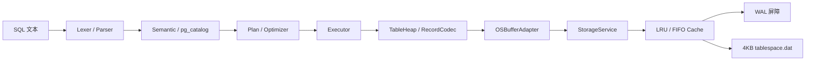

# 数据库系统集成设计

## 总体数据流



编译器不接触磁盘，操作系统层不理解 SQL，执行器不解析文本。两侧只通过 Plan、Catalog 与 PageStore 接口连接，因此每层可以单独测试。

## 逻辑存储如何对应物理存储

| 逻辑对象 | 物理表示 |
|---|---|
| 数据库 | 一个数据目录 |
| 表空间 | `storage/tablespace.dat` |
| 页 | 文件中 `[page_id×4096, (page_id+1)×4096)` 的 4096 字节 |
| 系统目录 | 从保留页 0 开始的 `SYP1` 槽页链；每列是一条二进制目录记录 |
| 用户表 | `TableSchema.first_page` 指向首页，页头 `next_page` 串成页链 |
| 行 | `RecordCodec` 二进制 payload |
| 行地址 | RID = `(page_id, slot_id)` |
| 删除 | 对应 slot 的 length 置 0 |

`tablespace.dat` 只放完整 4KB 页；`control.0.json/control.1.json` 是双份页目录，记录分配位图、页 generation、CRC 与 checkpoint LSN；`redo.wal` 保存已持久化的页 after-image。目录信息和业务行不会落到 SQLite 或独立 JSON 数据文件。

## 4KB 数据页布局

```text
低地址
┌─────────────────────────────────────────┐
│ Header 18B: magic/page_id/slot_count/   │
│ free_start/free_end/next_page           │
├─────────────────────────────────────────┤
│ Slot[0] 4B │ Slot[1] 4B │ ...           │  → 向高地址增长
├──────────────── 空闲区 ─────────────────┤
│       ... 记录 N ... 记录 1 ...          │  ← 从页尾向低地址增长
└─────────────────────────────────────────┘
高地址
```

槽保存 `(offset,length)`。记录移动时 RID 仍可通过槽定位；逻辑删除只需原子地清零 length。记录格式为 `[字段数:u16][NULL bitmap][字段体]`：INT 用小端 8 字节，VARCHAR 用 4 字节长度前缀加 UTF-8 字节，因此中文按字节长度保存而不是按字符数猜测。

## 接口为什么这样设计

`PageStore` 只暴露 `allocate_page`、`release_page`、`read_page`、`write_page`、`checkpoint`、`stats`。选择固定大小 bytes 接口的原因：

1. 数据库层决定页内格式，OS 层只保证页的可靠读写，职责不交叉。
2. 可把 LRU 换成 FIFO，而不修改 SQL、计划或行编码代码。
3. 每次写入是完整页 after-image，WAL 重放和 CRC 校验都比局部补丁更直观，适合一周实训答辩。
4. 接口小，错误边界明确：非法页号、页长错误、CRC 错误、WAL 屏障错误分别在底层产生。

没有采用 mmap，因为它会把具体刷盘时机交给操作系统，难以演示 dirty、WAL-before-data 与 checkpoint；没有让执行器直接读文件，因为那会绕过缓存和恢复机制。

## 基本算子如何执行

- CreateTable：写入 `PagedCatalog`；目录从页 0 开始，容量不足时分配下一槽页并建立页链，所有目录页都经 WAL/页服务落盘。
- Insert：表达式求值 → 行编码 → 遍历表页链找空位 → 必要时分配新页并更新 `first_page/next_page`。
- SeqScan：从 `first_page` 开始逐页读取，每个有效 slot 解码为行。
- Filter：对子算子输出逐行计算 WHERE 表达式。
- Project：只构造 SELECT 指定字段。
- Delete：对满足条件的 RID 写 tombstone。

## 两项扩展

UPDATE 使用 `Update → Filter → SeqScan`。赋值表达式全部基于原行求值，符合“同时赋值”直觉；新记录能放回原槽时只改本页，放不下时先插入新位置再删除旧 RID。

ORDER BY 在 Filter 后、Project 前插入 Sort，这样即使排序列没有出现在最终投影中也能正确排序。多列排序从最后一个键向前做稳定排序；本项目不接受 SQL `NULL` 字面量。

## 同步、崩溃与恢复

`write_page` 的顺序是：完整页追加 WAL → `fsync(WAL)` → 内存 frame 标脏。脏页达到比例阈值、被淘汰、显式 checkpoint 或正常关闭时刷回。刷页前检查 `page_lsn <= durable_lsn`，否则抛出 `WriteBarrierError`。

服务器在 WAL 已落盘但数据页未落盘时崩溃，重启会扫描 checkpoint 之后的日志；仅当磁盘 generation 较旧时重放，所以恢复可重复执行。checkpoint 完成后才更新双份控制文件中的 checkpoint LSN。该模型提供页级 redo，不声称支持多语句事务回滚。
