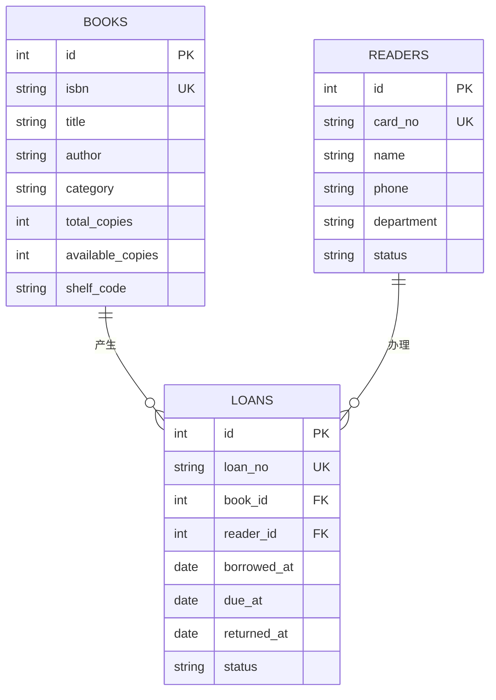

# 数据库设计说明

## 业务范围

系统面向小型图书室，管理图书、读者和借阅流转。一本图书可以有多份副本；一次借阅只对应一种图书和一位读者。

## ER 图

## 完整性约束

- `isbn`、`card_no`、`loan_no` 唯一，避免重复业务编号。
- 借阅通过外键关联图书和读者，禁止删除仍被借阅记录引用的数据。
- `available_copies` 必须介于 0 与 `total_copies` 之间。
- 读者状态限定为“正常/停用”，借阅状态限定为“借阅中/已归还”。
- 借出和归还均在同一事务内同时更新借阅记录与库存。

## 关键查询

- 聚合统计：总副本数、可借数、读者数、借阅中数量。
- 多表连接：借阅记录连接图书和读者，得到完整展示信息。
- 派生状态：未归还且应还日期早于当天时显示“已逾期”。
- 模糊检索：通过书名、作者、ISBN、姓名、读者证和借阅编号搜索。
